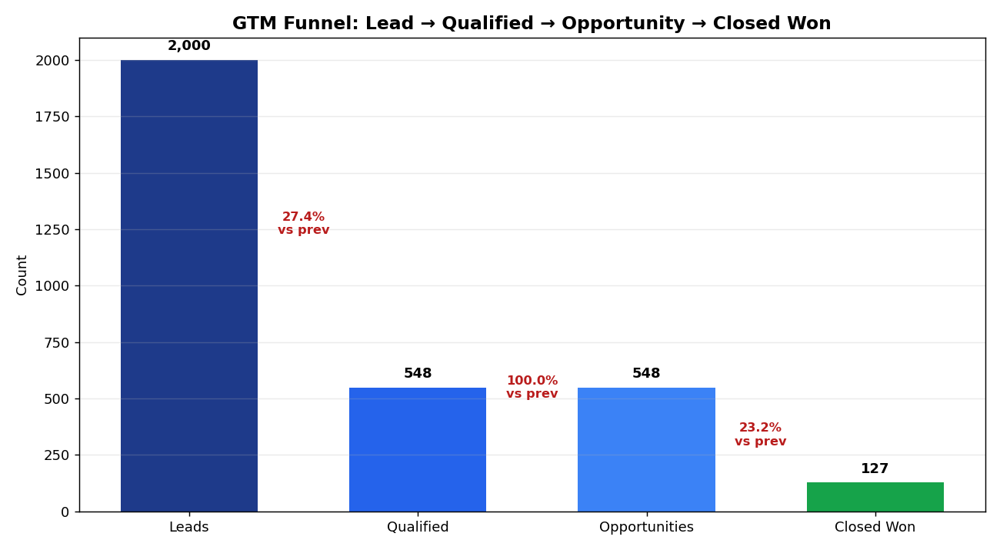
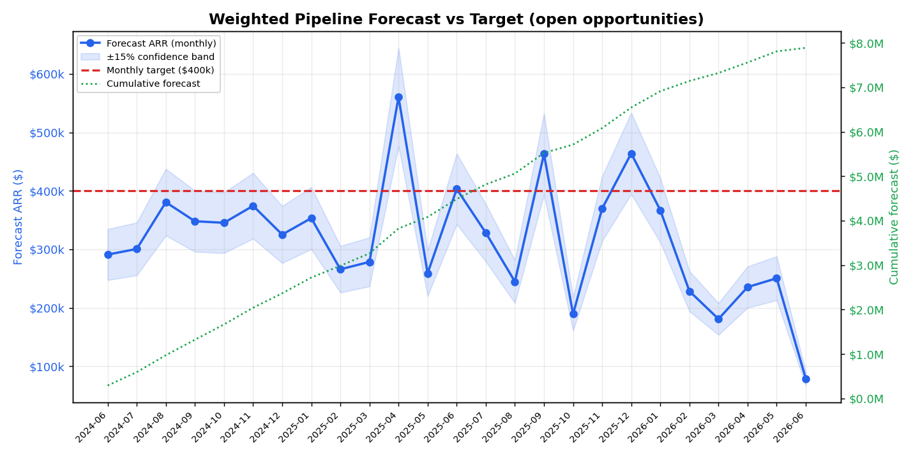

# SaaS Revenue Funnel Analytics

An end-to-end go-to-market (GTM) pipeline analytics project that takes simulated CRM data from raw generation through SQL cleaning, Python enrichment and modelling, and into a fully specified Power BI dashboard. Every Python and SQL step is runnable as-is and reproducible from a fixed random seed.

## Outputs at a glance

| Funnel | Forecast vs Target |
|---|---|
|  |  |

**Stack:** Python (pandas, numpy, scikit-learn, matplotlib) · SQL (ANSI / SQLite / PostgreSQL) · Power BI (DAX, star schema)

---

## Folder structure

```
SaaS-Revenue-Funnel-Analytics/
├── README.md                          # Phase 6 — this file (project front page)
├── requirements.txt                   # Python dependencies
├── .gitignore
├── phase1_data_generation.py          # Phase 1 — generates the 4 raw tables + dim_rep
├── phase2_cleaning_validation.sql     # Phase 2 — profiling, cleaning, 8 analytical queries (ANSI SQL)
├── phase2_run_sql.py                  # Phase 2 — loader: runs the SQL on the CSVs, exports clean tables
├── phase3_enrichment_modelling.py     # Phase 3 — features, KMeans, forecast, charts, modelled exports
├── data/
│   ├── leads_raw.csv                  # Phase 1 output (with planted DQ issues)
│   ├── opportunities_raw.csv          # Phase 1 output
│   ├── closed_deals_raw.csv           # Phase 1 output
│   ├── dim_date.csv                   # Phase 1 output (date dimension)
│   ├── dim_rep.csv                    # Phase 1 output (rep dimension, used in Phase 4)
│   ├── leads_clean.csv                # Phase 2 output (deduped, standardised)
│   ├── opportunities_clean.csv        # Phase 2 output (imputed)
│   ├── closed_deals_clean.csv         # Phase 2 output (validated)
│   ├── opportunities_modelled.csv     # Phase 3 output (engineered features)
│   ├── closed_deals_segmented.csv     # Phase 3 output (KMeans cluster labels)
│   └── forecast_summary.csv           # Phase 3 output (quarterly weighted forecast)
├── charts/
│   ├── forecast_chart.png             # Phase 3 — weighted forecast vs target (±15% band)
│   └── funnel_chart.png               # Phase 3 — lead→qualified→opp→won funnel
└── docs/
    ├── phase4_powerbi_data_model.md   # Phase 4 — import, star schema, 20 DAX measures
    └── phase5_powerbi_report_layout.md# Phase 5 — 5-page report spec
```


e.
